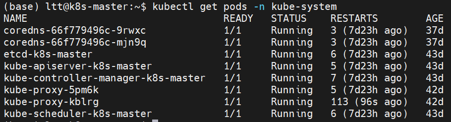
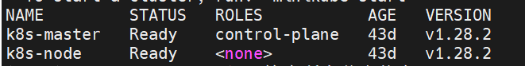

# Day 1: 环境验证与准备

## 环境概览
- **操作系统**: Ubuntu 22.04
- **Kubernetes集群**: 生产级多节点集群
- **集群版本**: v1.28.2
- **运行时间**: 43天

## 集群状态验证

### 节点状态
集群包含2个节点，均处于Ready状态：
- k8s-master (control-plane, 43天)
- k8s-node (worker, 43天)

### 系统组件健康状态
所有kube-system命名空间下的核心组件运行正常：
- CoreDNS: Running
- etcd: Running  
- kube-apiserver: Running
- kube-controller-manager: Running
- kube-scheduler: Running
- kube-proxy: Running

## 验证命令
